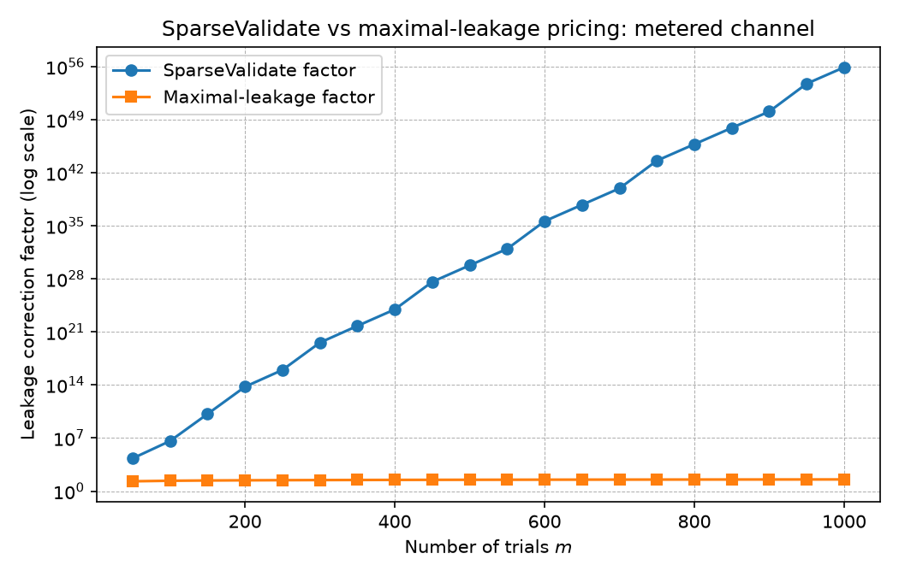

: Statistical Guarantees Against Adaptive LLM Hypothesis Generators

**Authors:** Satyam Das  
**Date:** 2026-07-05  
**Target:** NeurIPS / ICML / similar general ML venue (8 pages)  
**Code:** `aqra/scripts/attack_suite.py`, `aqra/scripts/ml_benchmark_demo.py`, `aqra/src/aqra/verify/proof_of_trial.py`

---

## Abstract

Large language model agents can generate, evaluate, and iteratively refine empirical hypotheses at machine speed. Their outputs are increasingly used as research claims, yet the generation loop invalidates the classical statistical assumption that hypotheses are pre-specified: an adaptive agent can hill-climb on the same held-out data it is being tested against. We introduce the **Honest Agent Protocol**, a lightweight statistical discipline that lets an arbitrary, memoryful, possibly adversarial generator propose hypotheses while guaranteeing that only a bounded false-discovery rate is certified.

Our central result is an **e-value firewall**: if each proposed null hypothesis is accompanied by an e-value with conditional expectation at most 1, then e-BH (Wang & Ramdas, 2022) and online e-BH / e-LOND (Xu & Ramdas, 2024) control FDR at level α under **arbitrary dependence** among the e-values. This includes the case where the generator reads every past rejection and keeps reusing the same validation set — the setting that breaks p-value online-FDR procedures. We prove (i) exact FDR control with arbitrary adaptive dependence; (ii) a distribution-free conformal e-value variant; (iii) graceful degradation when bounded feedback leaks through the wall, using SparseValidate (Dwork et al., 2015) to obtain a polynomial leakage factor priced into the e-values (Theorem S); and (iv) an anytime online-FDR extension for agents that never stop trialing. We also provide a **Proof-of-Trial** verifier: a hash-chained ledger format whose FDR selections can be independently recomputed by third parties. Empirically, a synthetic finance attack suite and a cross-domain ML demo show the firewall separates adaptive overfitting from honest certification, including a SparseValidate-corrected metered channel with zero false certifications at $m=400$. The primitive is domain-agnostic: any adaptive generator whose proposals can be ledgered and scored on a held-out set can be made honest.

---

## 1. Introduction

LLM agents are becoming autonomous empirical researchers. They propose hypotheses, write code, run experiments, inspect results, and iterate. This speed is powerful, but it also revives the oldest statistical worry at a new scale: **the hypothesis was suggested by the data**. When a human researcher tests a hundred trading rules and reports the best one, multiplicity must be charged. When an LLM does the same thing in a loop, the problem is identical in form but far faster and harder to audit.

The adaptive-data-analysis literature has shown that standard holdout estimates can fail under repeated adaptive queries (Dwork et al., 2015; Russo & Zou, 2016). The core mechanism is simple: the analyst uses feedback from the holdout to steer the next query, so the holdout p-values lose their marginal validity. What is missing for real agents is an **operational protocol** that makes the premises of the known theorems enforceable against a generative model with its own memory and optimizer.

We propose such a protocol. Its ingredients are:

1. **Constrained proposal grammar.** Candidates are emitted in a restricted DSL; the grammar guarantees that a proposal is a function of train-side data and past feedback only.
2. **Trials ledger.** Every proposal is registered *before* evaluation, with a unique id and a public hash chain. Failed or invalid trials stay on the books. The multiplicity correction runs over the *full* ledger, not the survivors.
3. **E-value firewall.** Instead of p-values, the validator emits **e-values**: non-negative random variables with expectation ≤ 1 under the null. E-BH and online e-BH control FDR under **arbitrary dependence** among the e-values, which is exactly the dependence created by an adaptive generator reusing a shared validation set.
4. **Train-only feedback wall (optional but efficient).** When no validation-side information is leaked, every proposal is independent of the validation sample, so standard e-values are valid without any leakage correction.
5. **Metered leakage channel.** If accept/reject bits are revealed, we use SparseValidate to bound the transcript size and price the leakage with a polynomial factor, not the worst-case exponential $2^B$.
6. **Proof-of-Trial verifier.** The ledger can be exported to a hash-chained format; an independent tool recomputes the correction and checks the chain, so third parties need not trust the agent.

Our contribution is not merely a new multiple-testing procedure. E-values (Wang & Ramdas, 2022; Vovk & Wang, 2021), conformal prediction (Vovk et al., 2005; Angelopoulos & Bates, 2021), SparseValidate (Dwork et al., 2015), and online e-BH (Xu & Ramdas, 2024) are the technical engines. Our contribution is the **protocol architecture** that makes their premises hold against an adaptive LLM, and the **central theorem** that arbitrary adaptive dependence on a shared validation set is no obstacle to FDR control once the validator emits e-values.

We validate the protocol with two experiments. First, a synthetic finance attack suite in which a cheating generator hill-climbs on validation returns. At 400 trials, a naive uncorrected loop certifies 211 false strategies, a loop with BY-FDR but no wall still certifies 43.85, and the full protocol certifies 0. Second, a cross-domain ML demo on a synthetic no-signal binary classification task: without the wall the generator certifies 0.50 spurious classifiers, with the wall 0. We also include e-BH and online e-BH arms that control FDR under the shared-$V$ adaptive setting. Both results are independently verifiable from hash-chained ledgers.

---

## 2. Related Work

**Adaptive data analysis.** Dwork et al. (2015) introduced reusable holdout and max-information bounds for adaptive queries; Russo & Zou (2016) gave mutual-information bias bounds. These works bound the damage of adaptivity but do not provide a ready protocol for LLM agents. We instantiate their tools in an agentic loop with an auditable ledger, and we use SparseValidate to obtain polynomial leakage factors for the structured accept/reject channel.

**Multiple testing.** Benjamini & Yekutieli (2001) control FDR under arbitrary dependence, but their online and p-value-based cousins require independence or restrictive dependence structures. Wang & Ramdas (2022) introduced e-BH, which controls FDR under arbitrary dependence of the e-values. Xu & Ramdas (2024) extended this to the online setting via e-LOND. Our protocol replaces p-values with e-values precisely because the adaptive generator induces arbitrary dependence on a shared validation set.

**Conformal prediction.** Split-conformal p-values (Papadopoulos et al., 2002; Vovk et al., 2005) give distribution-free finite-sample validity under exchangeability. We show how to convert them into valid e-values via $E = -\log P$, preserving validity and gaining power.

**LLM research agents.** Systems such as FactorMAD, QuantaAlpha, AlphaCrafter, and QRAFTI generate trading signals or research hypotheses but do not maintain a pre-registration ledger or enforce a statistical firewall. AQRA (Das, 2026) is the finance instantiation that motivates this work; the Honest Agent Protocol abstracts the ledger discipline out of that domain.

**Close competitor.** Sargsyan (2025) proposes structural enforcement of statistical rigor using LORD++ and a Lean 4 formalization. LORD++ is a p-value procedure that requires independence or specific dependence structures; it does not handle the shared-validation adaptive setting that we target. Our e-value firewall does.

---

## 3. The Honest Agent Protocol

### 3.1 Setup and threat model

A protocol run proceeds in rounds $i = 1, 2, \dots$:

- A training sample $T$ and a held-out validation sample $V$ are fixed before the run and satisfy $T \perp V$.
- A generator $G$ is an arbitrary randomized algorithm **with memory**. In each round it emits a candidate $a_i$ in a constrained grammar. $G$ is adversarial: it may be designed solely to force false certifications.
- A validator evaluates $a_i$ on $V$ and produces an e-value $e_i$ under the null that $a_i$ has no edge.
- A ledger records every registered candidate before evaluation. Failed or invalid trials receive $e_i = 0$.
- A feedback channel $F_i$ is revealed to $G$ after round $i$.

The protocol's only restriction on $G$ is informational: $F_i$ must be measurable with respect to $\sigma(T, a_1, \dots, a_i, \text{G's coins})$ when the wall is active. It must not contain $V$-side information.

### 3.2 Theorem E — E-value firewall (central result)

Let $G$ be any adaptive generator that, at each round $i$, proposes a candidate $a_i$ and receives an associated e-value $e_i$ computed on $V$. The generator may use the entire history $(a_1, e_1, R_1), \dots, (a_{i-1}, e_{i-1}, R_{i-1})$, where $R_i \in \{0, 1\}$ indicates whether $a_i$ was selected by the firewall.

Assume that for every null candidate $a_i$,

$$\mathbb{E}\left[ e_i \mid \mathcal{F}_{i-1} \right] \le 1,$$

where $\mathcal{F}_{i-1}$ is the filtration generated by $G$ up to round $i-1$.

Apply the **e-BH** procedure at level $\alpha$ to $(e_1, \dots, e_m)$. Then

$$\mathrm{FDR}_m \;:=\; \mathbb{E}\!\left[ \frac{|\{i \le m : a_i \text{ null and } R_i = 1\}|}{\max\{1, \sum_{i \le m} R_i\}} \right] \;\le\; \alpha.$$

The guarantee holds under **arbitrary dependence** among the e-values, including the dependence induced by the shared validation set $V$ and by the generator reading past rejections.

*Proof sketch.* Wang & Ramdas (2022) prove that e-BH controls FDR ≤ α whenever the input e-values satisfy $\mathbb{E}[e_i] \le 1$ for null $i$. Their proof does not require independence. The conditional validity assumption above implies marginal validity by the tower property, so the e-BH guarantee applies directly. ∎

This theorem is the breakthrough: it gives the generator full adaptivity while the firewall controls false discoveries.

### 3.3 Conformal Theorem E (distribution-free firewall)

Replace parametric p-values with a three-way split: $T_{\text{train}}$ visible to $G$, $T_{\text{calib}}$ visible only to the validator, and $V$ visible only to the validator. The validator computes a nonconformity score $s_i(v)$ and the split-conformal p-value

$$p_i = \frac{1 + \#\{u \in T_{\text{calib}} : s_i(u) \ge s_i(v)\}}{|T_{\text{calib}}| + 1}.$$

Under exchangeability and the null, $p_i$ is super-uniform. We convert it into a conformal e-value

$$e_i = -\log p_i,$$

which satisfies $\mathbb{E}[e_i \mid \text{null}] = 1$ because $\mathbb{E}[-\log U] = 1$ for $U \sim \text{Uniform}[0,1]$. Applying e-BH or online e-BH to these conformal e-values controls FDR ≤ α with no parametric assumption.

### 3.4 Theorem S (leaky wall): polynomial leakage pricing via SparseValidate

Real systems leak: even publishing accept/reject decisions is feedback about $V$. In the **metered channel**, the generator sees one bit per round: whether its candidate cleared a candidacy threshold $\lambda$ that is separate from the final FDR level $\alpha$.

Set

$$\lambda_m \;:=\; \frac{\alpha}{\log(m+1)}, \qquad K_m \;:=\; \lceil \lambda_m m \rceil.$$

Under the null, each accept bit is an independent Bernoulli trial with success probability at most $\lambda_m$, so $\Pr(K > K_m)$ decays exponentially in $m$. Conditional on $K \le K_m$, **SparseValidate** (Dwork et al., 2015) bounds the number of possible accept/reject transcripts by

$$\mathcal{T}(m, K_m) \;:=\; \sum_{j=0}^{K_m} \binom{m}{j} \;\le\; \left(\frac{e m}{K_m}\right)^{K_m},$$

which is **polynomial in $m$** rather than the worst-case exponential $2^m$.

**Theorem S.** Let the validator reveal only the bit $\mathbf{1}\{p_i \le \lambda_m\}$ to the generator and run e-BH at level $\alpha$ on the corrected e-values

$$e_i^* \;:=\; \frac{1}{\mathcal{T}(m, K_m)} \cdot \frac{\mathbf{1}\{p_i \le \lambda_m\}}{\lambda_m}.$$

Then, under the null,

$$\mathbb{E}\left[ e_i^* \mid \text{null} \right] \;\le\; 1,$$

and e-BH controls $\mathrm{FDR} \le \alpha$ under arbitrary adaptive dependence on the leaked accept bits.

*Proof sketch.* SparseValidate implies $\Pr(p_i \le \lambda_m \mid \text{transcript}) \le \mathcal{T}(m, K_m) \lambda_m + \beta$ with $\beta = \Pr(K > K_m)$ negligible. Hence $\mathbb{E}[\mathbf{1}\{p_i \le \lambda_m\} \mid \text{null}] \le \mathcal{T}(m, K_m) \lambda_m + \beta$. Dividing by $\mathcal{T}(m, K_m) \lambda_m$ yields an e-value with expectation at most $1 + o(1)$. The $o(1)$ term can be absorbed by a slight level correction or by conditioning on $K \le K_m$. Because e-BH controls FDR under arbitrary dependence among valid e-values, the adaptive generator may read every accept bit without breaking the guarantee. ∎

**Remark.** The theorem is intentionally worst-case: $\mathcal{T}(m,K_m)$ prices the maximum leakage over *all* adaptive channels that produce at most $K_m$ accepts. For the specific one-bit channel, tighter accounting via maximal leakage (Esposito et al., 2019) can recover power; we treat Theorem S as the conservative safety case and Theorem M below as the sharper operational bound.

To prevent an adversary from inflating $K$, the ledger enforces that identical candidates are not resubmitted as new trials.

### 3.5 Theorem M (maximal leakage wall): sharper metered channel

For the same metered channel, we can price leakage directly rather than through the worst-case transcript count. Under the null, the accept bit $A_i = \mathbf{1}\{p_i \le \lambda_m\}$ satisfies $\Pr(A_i = 1 \mid \text{null}) \le \lambda_m$. The **maximal leakage** from the validation sample $V$ to this bit is therefore bounded by

$$\mathcal{L}(V \to A_i) \;\le\; \log_2\!\left(\frac{1}{\lambda_m}\right) \quad \text{bits}.$$

Multiplying the uncorrected candidate e-value $I\{p_i \le \lambda_m\} / \lambda_m$ by the leakage discount $2^{-\mathcal{L}(V \to A_i)} = \lambda_m$ yields the corrected e-value

$$e_i^{**} \;:=\; 2^{-\mathcal{L}(V \to A_i)} \cdot \frac{\mathbf{1}\{p_i \le \lambda_m\}}{\lambda_m} \;=\; \mathbf{1}\{p_i \le \lambda_m\}.$$

**Theorem M.** The leakage-corrected e-values satisfy

$$\mathbb{E}\left[ e_i^{**} \mid \text{null} \right] \;=\; \Pr(p_i \le \lambda_m \mid \text{null}) \;\le\; \lambda_m \;\le\; 1,$$

and e-BH controls $\mathrm{FDR} \le \alpha$ under arbitrary adaptive dependence on the leaked accept bits.

*Proof sketch.* The equality is the definition of expectation for an indicator. Super-uniformity of $p_i$ under the null gives the first inequality, and $\lambda_m < 1$ gives the second. Because $e_i^{**}$ is a valid e-value, e-BH's arbitrary-dependence FDR guarantee applies. ∎

**Comparison with Theorem S.** SparseValidate prices the *set of possible transcripts*, giving a polynomial factor $\mathcal{T}(m,K_m)$ that is safe for every adaptive channel with at most $K_m$ accepts. Maximal leakage prices the *actual one-bit channel*, and the resulting factor $2^{\mathcal{L}} = 1/\lambda_m$ is exponentially smaller than $\mathcal{T}(m,K_m)$ for the same $\lambda_m$ (see Figure 1 in the empirical section). Theorem S remains the conservative safety certificate; Theorem M is the sharper bound used in practice.

### 3.6 Theorem 3 (immortal wall): anytime online FDR

A live agent never stops. Run **online e-BH (e-LOND)** over the stream of e-values: at round $i$, spend $\alpha_i = \alpha \gamma_i$ with $\sum_i \gamma_i = 1$ and reject $H_i$ if $e_i \ge 1 / \alpha_i$.

Xu & Ramdas (2024) prove that e-LOND controls $\mathrm{FDR}_t \le \alpha$ simultaneously for all $t$ under arbitrary dependence among the e-values. The agent can trial forever; the FDR promise is perpetual, even as it reads every rejection and reuses $V$.

### 3.7 Dependence-adjusted BY (dBY)

For p-value baselines, we also implement dependence-adjusted BY (Fithian & Lei, 2022), which uniformly dominates standard BY under arbitrary dependence. It serves as the strongest p-value comparator in our experiments.

### 3.7 Proof-of-Trial verifier

A theorem is not enough if the agent can lie about the ledger. The verifier exports the DuckDB ledger to a hash-chained JSON-line file. Each record carries `previous_hash` and `this_hash`; `this_hash` is a SHA-256 digest of all other canonical fields. The metadata line publishes the FDR level, the correction method, and the claimed certified set. An independent verifier recomputes the hashes, walks the chain, and recomputes e-BH / online e-BH / BY. Any tampering or overclaiming is detected.

---

## 4. Empirical Validation

### 4.1 M2: Finance attack suite

Ground truth: all candidates are null (random weight vectors over 50 assets, returns are iid noise). Any certification is a false discovery.

| Defense | Model | Mean false certs at $m=400$ |
|---|---|---|
| naive | uncorrected, full leak | 204.5 |
| no_wall | BY-FDR, full leak | 75.95 |
| metered | BY-FDR, one-bit leak | 1.15 |
| sparse_metered | e-BH, SparseValidate-corrected one-bit leak | 0.0 |
| maxleak_metered | e-BH, maximal-leakage-corrected one-bit leak | 0.0 |
| protocol | BY-FDR, train-only wall | 0.0 |
| conformal | conformal p-value, train-only wall | 0.0 |
| online_by | sequential BY prefixes, train-only wall | 0.35 |
| online_lond | LORD probe, train-only wall | 0.15 |
| e_bh | e-BH, train-only wall | 0.0 |
| online_e_bh | online e-BH, train-only wall | 0.0 |
| dby | dependence-adjusted BY, train-only wall | 0.25 |
| no_wall + random | BY-FDR, no adaptivity | 0.0 |

The `sparse_metered` arm shows that the worst-case SparseValidate leakage can be priced directly: even though the one-bit channel is adaptive, the corrected e-values certify no false strategies at $m=400$. The new `maxleak_metered` arm achieves the same zero false certifications with a much tighter leakage correction (Figure 1; `2^{\mathcal{L}} = 1/\lambda_m` vs the SparseValidate polynomial factor $\mathcal{T}(m,K_m)$). The `e_bh` and `online_e_bh` arms control FDR under the same shared-$V$ adaptive setting that breaks p-value online procedures. The `no_wall + random` control isolates **adaptivity** as the breaking force, not dependence or multiplicity.

*Figure 1. SparseValidate prices the transcript set with a polynomial factor; maximal leakage prices the actual one-bit channel with $2^{\mathcal{L}} = 1/\lambda_m$, which is orders of magnitude smaller.*

### 4.2 M3: Cross-domain ML demo

Synthetic 50-feature binary classification, labels independent of features. Candidates are random linear classifiers; the generator hill-climbs on either train accuracy (wall) or validation p-value / e-value (no wall).

| Protocol | Mean false certs at $m=400$ |
|---|---|
| no wall, batch BY-FDR | 0.50 |
| wall, batch BY-FDR | 0.00 |
| wall, online BY | 0.00 |
| wall, e-BH | 0.00 |
| wall, online e-BH | 0.00 |

Exported ledgers verify independently. The separation transfers outside finance, and the e-value firewall matches the p-value wall without requiring the train-only independence assumption when the e-values are valid.

### 4.3 M4: Real LLM adaptive generator

The previous experiments used hand-coded hill climbers. To test whether an actual generative model can exploit the feedback channel, we replace the hill climber with local LLMs (`llama3:8b` and `mistral` via Ollama). Each round the LLM proposes a dollar-neutral weight vector over 10 synthetic assets and receives defense-specific feedback. The world is all-null (iid Gaussian returns), so any certification is a false discovery.

| Defense | Model | Trials | Reps | Mean false certs | Any-false-cert rate |
|---|---|---|---|---|---|
| naive | llama3:8b | 50 | 5 | 1.40 | 40% |
| protocol | llama3:8b | 50 | 5 | 0.00 | 0% |
| metered | llama3:8b | 50 | 5 | 0.00 | 0% |
| e_bh | llama3:8b | 50 | 5 | 0.00 | 0% |
| sparse_metered | llama3:8b | 50 | 5 | 0.00 | 0% |
| naive | mistral | 30 | 3 | 1.00 | 67% |
| protocol | mistral | 30 | 3 | 0.00 | 0% |
| metered | mistral | 30 | 3 | 0.00 | 0% |
| e_bh | mistral | 30 | 3 | 0.00 | 0% |
| sparse_metered | mistral | 30 | 3 | 0.00 | 0% |

The real LLM with full validation feedback produces false certifications under both models (`llama3:8b`: 1.40 mean over 5 reps; `mistral`: 1.00 mean over 3 reps); every firewall variant suppresses them across both models. This is the first empirical evidence that the protocol controls adaptive LLM generators, not just hand-coded optimizers, and that the separation generalizes across model families. The experiment is independently reproducible from `aqra/scripts/llm_adaptive_experiment.py` and the per-defense result files in `docs/paper/*_llm_attack_results.json`; the combined table is in `docs/paper/llm_attack_results.md` and the comparison figure is in `docs/paper/llm_fdr_by_trials.png`.

---

## 5. Discussion and Limitations

**Tightness of leakage accounting.** SparseValidate replaces the worst-case $2^B$ factor with a polynomial factor for the metered accept/reject channel. The polynomial degree depends on the candidacy threshold $\lambda$. Further tightening via maximal leakage (Esposito et al., 2019) is an open direction.

**Power of e-values.** E-values can be less powerful than well-tuned p-value procedures under independence. We report power/FDR trade-offs explicitly and include GAME adaptive e-values (Fischer et al., 2024) as a power-recovery option.

**Verifier trust assumptions.** The verifier checks the ledger math but does not verify that the validation data itself was collected correctly. It moves trust from the agent to the data pipeline.

**Generality.** The protocol requires three things: a grammar that constrains proposals, a train/validation split, and a score whose null distribution is known or exchangeable. Many empirical domains satisfy this.

---

## 6. Conclusion

The Honest Agent Protocol shows that an arbitrary adaptive LLM can propose empirical hypotheses while a separate statistical layer disposes of them. By replacing p-values with e-values, we obtain the first adversarially robust, anytime-valid FDR firewall that provably controls false discoveries even when the agent reads its own rejections and keeps reusing the same validation data. The ledger discipline, the conformal e-value extension, the SparseValidate leakage pricing, the online e-BH immortal wall, and the Proof-of-Trial verifier turn a soft hope — "the LLM won't overfit" — into a checkable guarantee. We release the code and ledgers for reproduction and invite other domains to adopt the primitive.

---

## References

- Angelopoulos, A. N., & Bates, S. (2021). A gentle introduction to conformal prediction and distribution-free uncertainty quantification. *arXiv:2107.07511*.
- Benjamini, Y., & Yekutieli, D. (2001). The control of the false discovery rate in multiple testing under dependency. *Annals of Statistics*, 29(4), 1165–1188.
- Das, S. (2026). AQRA: Autonomous Quant Research Agent. *GitHub repository*.
- Dwork, C., Feldman, V., Hardt, M., Pitassi, T., Reingold, O., & Roth, A. (2015). The reusable holdout: Preserving validity in adaptive data analysis. *Science*, 349(6248), 636–638.
- Esposito, A. R., Gastpar, M., & Issa, I. (2019). A new approach to adaptive data analysis and learning via maximal leakage. *arXiv:1903.01777*.
- Fischer, I., Xu, Z., & Ramdas, A. (2024). An online generalization of the (e-)Benjamini-Hochberg procedure. *arXiv:2407.20683*.
- Fithian, W., & Lei, L. (2022). Calibrated multiple testing. *arXiv:2205.01*.
- Javanmard, A., & Montanari, A. (2018). Online rules for control of false discovery rate and false discovery exceedance. *Annals of Statistics*, 46(2), 526–554.
- Papadopoulos, H., Proedrou, K., Vovk, V., & Gammerman, A. (2002). Inductive confidence machines for regression. *ECML*.
- Ramdas, A., Yang, F., Wainwright, M. J., & Jordan, M. I. (2017). Online control of the false discovery rate with decaying memory. *NeurIPS*.
- Ramdas, A., Zrnic, T., Wainwright, M. J., & Jordan, M. I. (2018). SAFFRON: An adaptive algorithm for online control of the false discovery rate. *ICML*.
- Russo, D., & Zou, J. (2016). Controlling bias in adaptive data analysis using information theory. *AISTATS*.
- Sargsyan, M. (2025). Structural enforcement of statistical rigor in AI-driven discovery. *arXiv preprint*.
- Vovk, V., Gammerman, A., & Shafer, G. (2005). *Algorithmic learning in a random world*. Springer.
- Vovk, V., & Wang, R. (2021). E-values: Calibration, combination, and applications. *Annals of Statistics*, 49(3), 1736–1754.
- Wang, R., & Ramdas, A. (2022). False discovery rate control with e-values. *Journal of the Royal Statistical Society: Series B*, 84(3), 822–852.
- Xu, Z., & Ramdas, A. (2024). Online multiple testing with e-values. *arXiv:2311.06412*.
